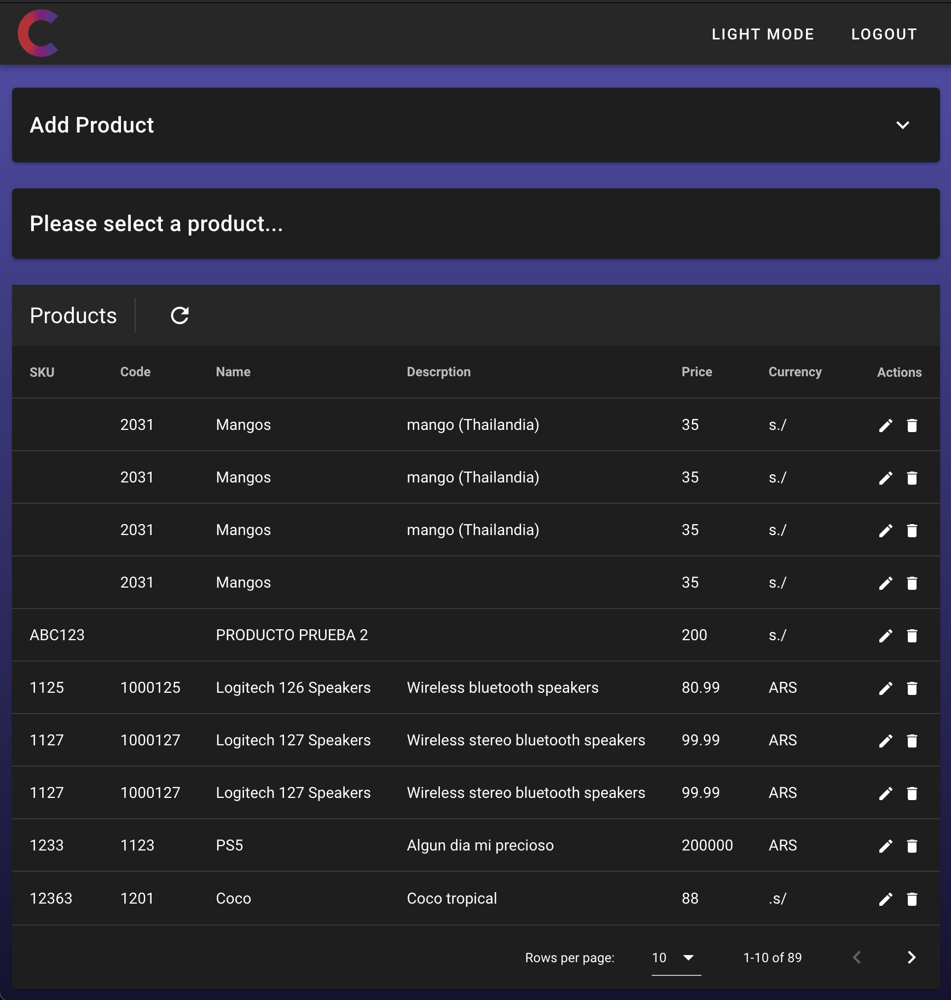
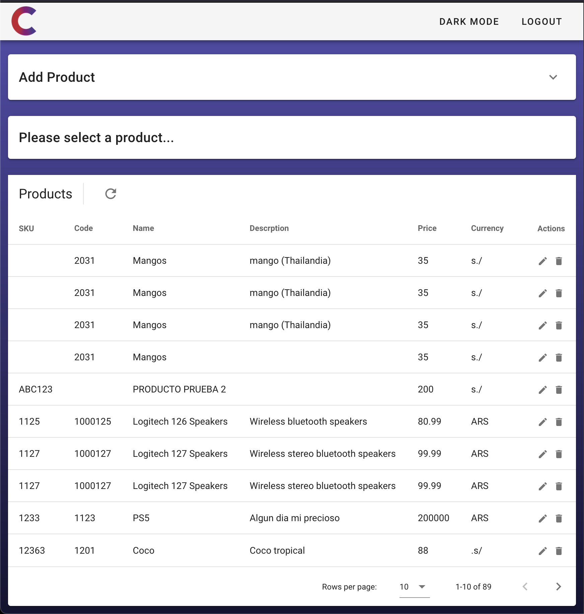
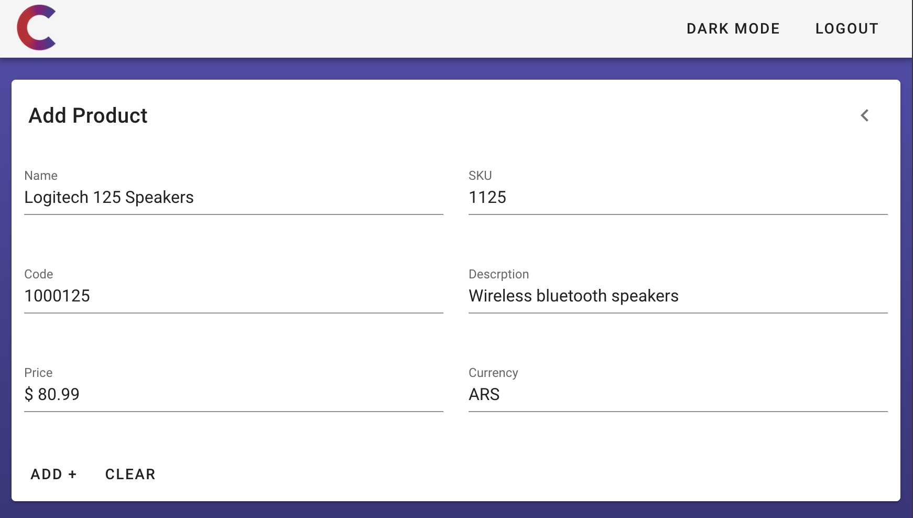
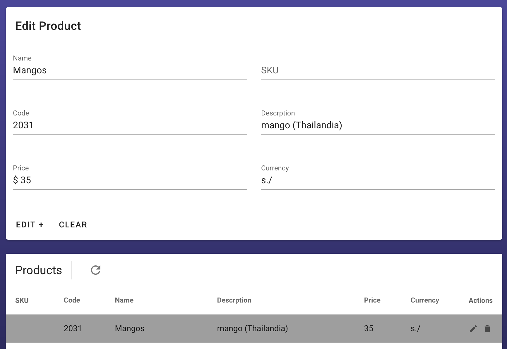

# Mongo Vue Node CRUD 
## Project setup
```
npm install
```
## Frontend
Vue.js 3 & Vuetify http://localhost:8080/
```
npm run frontend 
```
## Backend
Node & Express http://localhost:3000/
```
node run backend 
```
## Database
MongoDB & Mongoose
## Loggin and session!

## Available in Light & Darkmode !


## Add Product

## Edit & Delete Product

### Compiles and minifies for production
```
npm run build
```
### Lints and fixes files
```
npm run lint
```