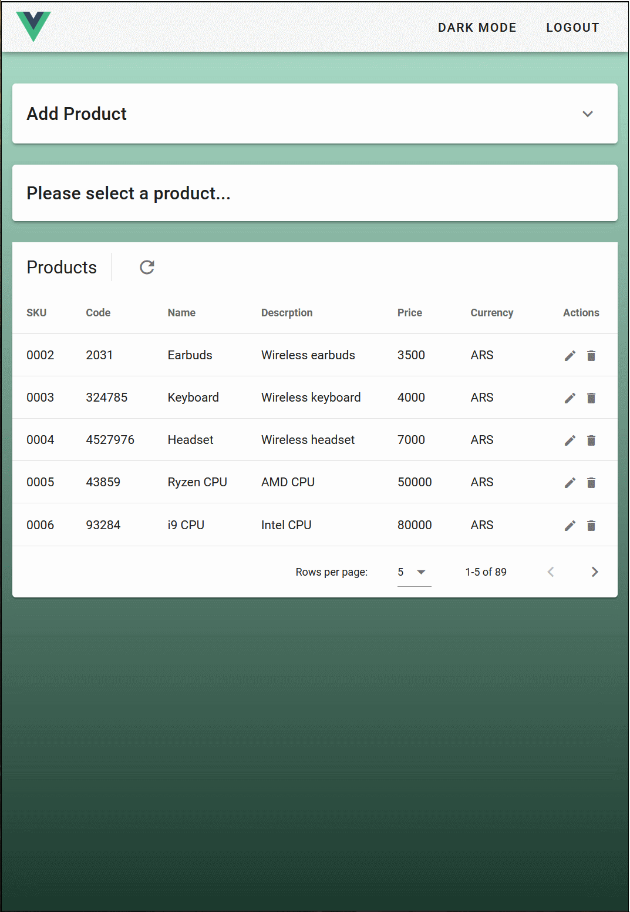

# Vue | Node | Mongo Login & Products CRUD
Front end with Vue 2 & Vuetify 2. 
Back end REST API with Node & Express
DB with MongoDB & Mongoose.

Currently, not a live version. Next update I promise!
Therefore... You'll need to provide your own mongoDB connection string.
## Project setup
```
npm install
npm run frontend 
node run backend 
```
http://localhost:8080/
## Loggin and session!

## Available in Light & Darkmode !

## Add & Delete a Product

## Edit Product

